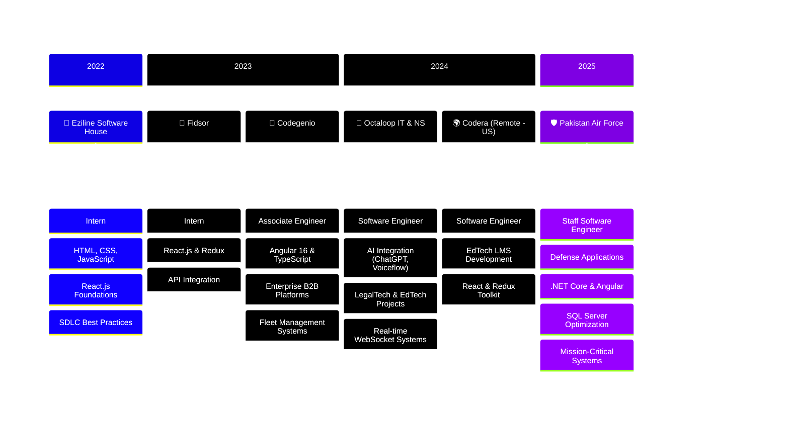

<div align="center">
  
<!-- Animated Header with Better Typography -->
[](https://git.io/typing-svg)

<!-- Social Badges -->
<p>
  <a href="https://www.linkedin.com/in/moneeburrehman/"></a>
  <a href="mailto:muhammadmoneeburrehman@gmail.com"></a>
  <a href="https://wa.me/923090460590"></a>
  <a href="https://github.com/moneebbhatti9"></a>
</p>


<!-- Divider -->


</div>

<!-- About Me Section -->
##  About Me


```typescript
const moneeb = {
    role: "Staff Software Engineer @ Pakistan Air Force",
    experience: "3+ years",
    location: "Islamabad, Pakistan 🇵🇰",
    focus: [
        "Full-Stack Development",
        "AI Integration", 
        "Enterprise Solutions"
    ],
    currentlyBuilding: "Mission-critical defense applications",
    passion: "Transforming complex problems into elegant AI-powered solutions"
};
```

<br/>

- 🏢 Building **enterprise-grade applications** for defense operations
- 🤖 Specializing in **AI-powered solutions** with ChatGPT, Gemini & Voiceflow
- 🌐 Crafting **real-time systems** with WebSockets & modern architectures
- 📚 Exploring **distributed systems** & advanced software architecture
- 💡 Passionate about **LegalTech, EdTech & Healthcare** innovations
- 🎯 Goal: Pursuing graduate studies in **AI & Software Architecture**

<br clear="both"/>

<div align="center">

</div>

---

<!-- Featured Projects with Enhanced Cards -->
##  Featured Projects

<table>
<tr>
<td width="50%" valign="top">

<h3 align="center">
 Splitifi Divorce
</h3>

<div align="center">

**AI-Driven LegalTech Platform**

<p><em>Transforming complex divorce processes into structured, data-driven experiences with intelligent legal guidance.</em></p>

<br/>


</div>
</td>

<td width="50%" valign="top">

<h3 align="center">
 TopProz B2B
</h3>

<div align="center">

**AI-Powered Lead Generation Platform**

<p><em>Scalable B2B web platform featuring real-time chat and AI-powered lead generation chatbot.</em></p>

<br/>


</div>
</td>
</tr>

<tr>
<td width="50%" valign="top">

<h3 align="center">
 AI Course Generator
</h3>

<div align="center">

**EdTech Learning Platform**

<p><em>AI-powered platform generating personalized courses, quizzes, and gamified content based on user profiles.</em></p>

<br/>


</div>
</td>

<td width="50%" valign="top">

<h3 align="center">
 Senior Care Platform
</h3>

<div align="center">

**Healthcare Management System**

<p><em>Real-time healthcare platform for patient care coordination with HIPAA-compliant design principles.</em></p>

<br/>


</div>
</td>
</tr>
</table>

---

<!-- Tech Stack with Unified Design -->
##  Tech Arsenal

<details open>
<summary><b>🎨 Frontend Development</b></summary>
<br/>
<div align="center">
<p>
  
</p>
<p>
  
</p>
</div>
</details>

<details open>
<summary><b>⚙️ Backend Development</b></summary>
<br/>
<div align="center">
<p>
  
</p>
<p>
  
  
  
</p>
</div>
</details>

<details open>
<summary><b>🗄️ Databases & Storage</b></summary>
<br/>
<div align="center">
<p>
  
</p>
<p>
  
  
</p>
</div>
</details>

<details open>
<summary><b>🤖 AI & ML Integration</b></summary>
<br/>
<div align="center">
<p>
  
  
  
</p>
<p>
  
  
  
</p>
</div>
</details>

<details open>
<summary><b>☁️ Cloud & DevOps</b></summary>
<br/>
<div align="center">
<p>
  
</p>
<p>
  
  
  
</p>
</div>
</details>

---

<!-- GitHub Stats with Fixed Streak -->
##  GitHub Analytics

<div align="center">
  
  
</div>

<br/>

<div align="center">
  
</div>

<br/>

<!-- Activity Graph -->
<div align="center">
  
</div>

---

<!-- Career Journey with Custom Mermaid Theme -->
##  Career Journey



<details>
<summary><b>📋 View Detailed Experience Table</b></summary>
<br/>

| Year | Company | Role | Domain | Key Achievements |
|:----:|:--------|:-----|:-------|:-----------------|
| **2025** | 🛡️ Pakistan Air Force | Staff Software Engineer | Defense | Mission-critical apps, DB optimization |
| **2024** | 🚀 Octaloop IT & NS | Software Engineer | LegalTech/EdTech | AI chatbots, Splitifi platform |
| **2024** | 🌍 Codera (US Remote) | Software Engineer | EdTech | LMS, Gamified learning |
| **2023** | 💼 Codegenio | Associate Engineer | B2B/Healthcare | SynerGym, Fleet Management |
| **2023** | 🔧 Fidsor | Intern | Web Development | React & State Management |
| **2022** | 🌱 Eziline | Intern | Web Development | Frontend Foundations |

</details>

---

<!-- Certifications -->
##  Certifications

<div align="center">
<p>
  
  
</p>
</div>

---

<!-- Education -->
##  Education

<div align="center">

| Degree | Institution | Year | Grade |
|:-------|:------------|:----:|:-----:|
| 🎓 **BS Computer Science** | University of Sargodha | 2019-2023 | 2.83 CGPA |
| 📚 **FSc Pre-Engineering** | Air Base Inter College Mushaf | 2017-2019 | A Grade |

</div>

---

<!-- Connect Section -->
##  Let's Connect

<div align="center">

**🌟 Open to collaborations on AI-powered web applications and innovative tech solutions!**

<br/>

<a href="https://www.linkedin.com/in/moneeburrehman/">
  
</a>
&nbsp;
<a href="mailto:muhammadmoneeburrehman@gmail.com">
  
</a>
&nbsp;
<a href="https://wa.me/923090460590">
  
</a>

<br/><br/>

<!-- Quote Card -->


</div>

---

<!-- Snake Animation -->
<div align="center">
  <picture>
    <source media="(prefers-color-scheme: dark)" srcset="https://raw.githubusercontent.com/platane/platane/output/github-contribution-grid-snake-dark.svg">
    <source media="(prefers-color-scheme: light)" srcset="https://raw.githubusercontent.com/platane/platane/output/github-contribution-grid-snake.svg">
    
  </picture>
</div>

---

<!-- Footer -->
<div align="center">
  
</div>
