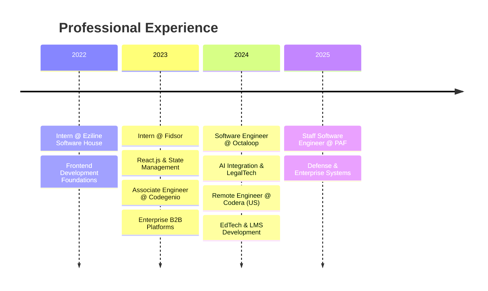

<div align="center">
  
<!-- Animated Header -->
[](https://git.io/typing-svg)

<p>
  <a href="https://www.linkedin.com/in/moneeburrehman/"></a>
  <a href="mailto:muhammadmoneeburrehman@gmail.com"></a>
  <a href="https://github.com/moneebbhatti9"></a>
</p>


</div>

---

## 🚀 About Me

```typescript
const moneeb = {
    role: "Staff Software Engineer @ Pakistan Air Force",
    experience: "3+ years",
    focus: ["Full-Stack Development", "AI Integration", "Enterprise Solutions"],
    currentlyBuilding: "Mission-critical defense applications",
    passion: "Transforming complex problems into elegant AI-powered solutions"
};
```


- 🔭 Building **enterprise-grade applications** for defense operations
- 🤖 Specializing in **AI-powered solutions** with ChatGPT, Gemini & Voiceflow
- 🌐 Crafting **real-time systems** with WebSockets & modern architectures
- 📚 Exploring **distributed systems** & advanced software architecture
- 💡 Passionate about **LegalTech, EdTech & Healthcare** innovations

<br clear="right"/>

---

## 🏆 Featured Projects

<table>
<tr>
<td width="50%">

### 🏛️ Splitifi Divorce
**AI-Driven LegalTech Platform**

Transforming complex divorce processes into structured, data-driven experiences with intelligent legal guidance.

`React` `Redux` `Node.js` `ChatGPT API` `Pinecone` `PostgreSQL` `Plaid API`

</td>
<td width="50%">

### 🤝 TopProz
**B2B Platform with AI Chatbot**

Scalable B2B web platform featuring real-time chat and AI-powered lead generation chatbot.

`Angular` `WebSockets` `MongoDB` `Voiceflow` `Node.js`

</td>
</tr>
<tr>
<td width="50%">

### 🎓 AI Course Generator
**EdTech Learning Platform**

AI-powered platform generating personalized courses, quizzes, and gamified content based on user profiles.

`React` `TypeScript` `Redux` `ChatGPT API` `Node.js`

</td>
<td width="50%">

### 🏥 Senior Care Platform
**Healthcare Management System**

Real-time healthcare platform for patient care coordination with HIPAA-compliant design.

`Angular 16` `WebSockets` `Node.js` `REST APIs`

</td>
</tr>
</table>

---

## 💻 Tech Arsenal

<details open>
<summary><b>🎨 Frontend</b></summary>
<br>
<p>
  
</p>
</details>

<details open>
<summary><b>⚙️ Backend</b></summary>
<br>
<p>
  
  
  
</p>
</details>

<details open>
<summary><b>🗄️ Databases</b></summary>
<br>
<p>
  
  
  
</p>
</details>

<details open>
<summary><b>🤖 AI & ML Integration</b></summary>
<br>
<p>
  
  
  
  
  
</p>
</details>

<details open>
<summary><b>☁️ Cloud & DevOps</b></summary>
<br>
<p>
  
  
</p>
</details>

---

## 📊 GitHub Analytics

<div align="center">
  
  
</div>

<div align="center">
  
</div>

---

## 🎯 Career Journey



---

## 🤝 Let's Connect

<div align="center">
  
**Open to collaborations on AI-powered web applications and innovative tech solutions!**

<a href="https://www.linkedin.com/in/moneeburrehman/">
  
</a>
<a href="mailto:muhammadmoneeburrehman@gmail.com">
  
</a>

</div>

---

<div align="center">
  
</div>
